# edge benchmark

### 1、**edge noload **

## **deviceid:02**

5.19 5.21 5.31 5.43 5.47 5.47 5.5 5.68 5.2 5.05 5.05 5.05 5.04 4.92 4.91 4.89 4.92 4.9 4.91 4.9 4.89 4.88 4.88 4.89 4.95 4.92 4.92 4.92 4.94 4.92 4.92 4.91 4.92 4.92 4.92 4.92 4.92 4.92 4.92 4.92 4.92 4.92 4.92 4.93 4.92 4.92 4.92  

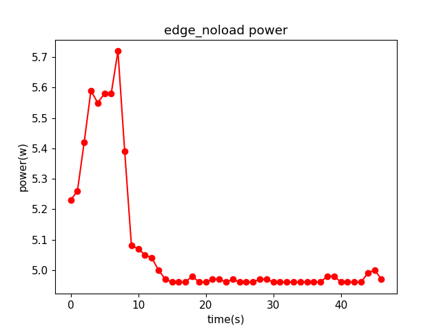

### 2、**edge encode **

### **deviceid:02     resolution:1280x720     bitrate:1000    preset:ultrafast       encode_used_time:20.932475090026855**

6.26 6.47 6.28 6.14 6.27 6.27 6.02 6.02 6.14 6.3 6.11 6.04 6.13 6.37 6.09 6.03 6.13 6.3 6.2 6.05 5.86 5.2 5.09 5.09 5.09 5.11 5.09 5.09 5.09 5.09 5.09 5.09 5.09 5.09 5.09 5.09 5.11 5.11 5.11 5.1

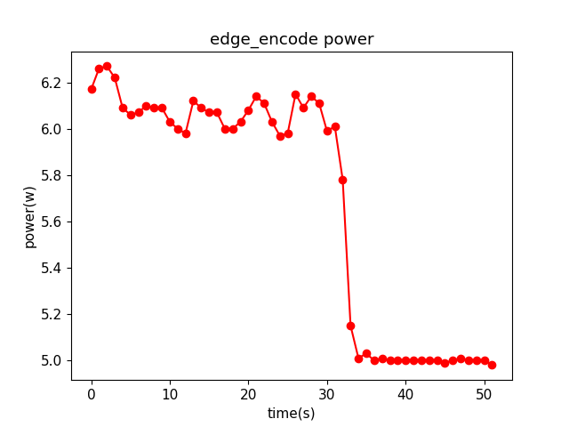

### **deviceid:02    resolution:1280x720    bitrate:500     preset:ultrafast     encode_used_time:15.269155740737915**

6.05 6.15 6.14 6.04 6.0 6.01 5.95 5.99 5.97 5.93 6.03 5.95 5.9 5.96 5.99 5.38 5.06 5.03 5.04 5.02 5.01 5.0 5.04 5.03 5.0 5.0 5.0 5.0 5.0 5.0 5.02 5.0 5.02 5.0

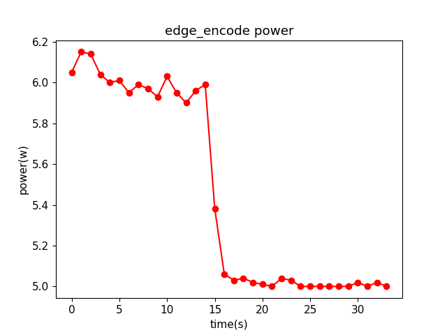

### **deviceid:02    resolution:1280x720    bitrate:1500    preset:ultrafast       encode_used_time:20.64082145690918**

6.28 6.29 6.08 5.99 6.2 6.13 5.95 5.97 6.2 6.18 5.97 5.96 6.25 6.2 5.98 5.96 6.16 6.22 5.96 5.93 5.55 5.03 4.96 4.96 4.96 4.96 4.96 4.96 4.97 4.96 4.96 4.96 4.96 4.97 4.96 4.96 4.96 4.96 4.96 4.96

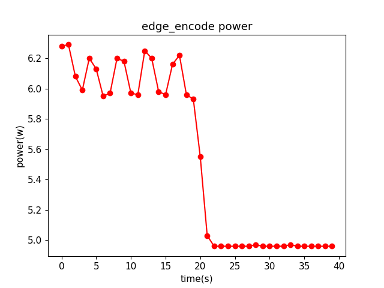

###  deviceid:02    resolution:720x480    bitrate:1000     preset:ultrafast       encode_used_time:22.31084442138672

6.0 6.08 5.84 5.84 5.77 6.02 5.76 5.71 5.7 6.01 5.88 5.7 5.68 5.95 5.94 5.72 5.72 5.77 6.06 5.78 5.68 5.68 5.18 4.96 4.92 4.94 4.92 4.92 4.93 4.96 4.96 4.96 4.96 4.96 4.96 4.96 4.96 4.96 4.96 4.97 4.97

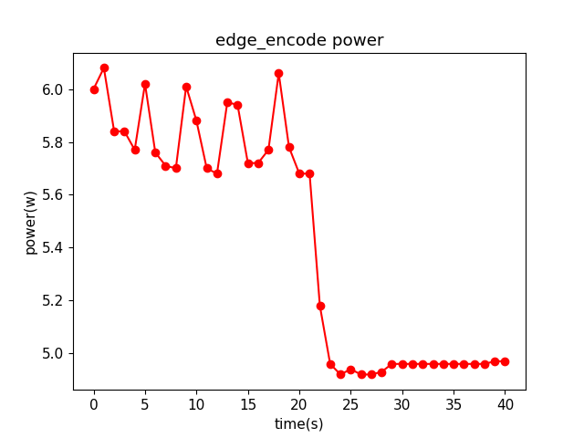

### deviceid:02    resolution:1280x720    bitrate:1000      preset:superfast       encode_used_time:32.865750312805176

6.17 6.26 6.27 6.22 6.09 6.06 6.07 6.1 6.09 6.09 6.03 6.0 5.98 6.12 6.09 6.07 6.07 6.0 6.0 6.03 6.08 6.14 6.11 6.03 5.97 5.98 6.15 6.09 6.14 6.11 5.99 6.01 5.78 5.15 5.01 5.03 5.0 5.01 5.0 5.0 5.0 5.0 5.0 5.0 5.0 4.99 5.0 5.01 5.0 5.0 5.0 4.98

### 3、**edge inference**

### **deviceid:02      modelid:02       inference_used_time:17.670751571655273**

10.94 12.91 12.46 12.67 13.75 14.35 13.79 12.75 13.88 12.96 13.65 13.89 13.93 12.9 13.84 14.45 14.04 7.93 5.78 5.56 5.56 5.55 5.17 4.97 4.96 4.96 4.96 4.96 5.08 4.94 4.92 4.92 4.92 4.92 4.92 4.92

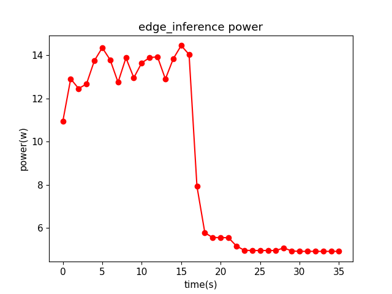

###  **deviceid:02      modelid:01         inference_used_time:9.721506834030151**

9.43 11.3 11.26 11.52 11.71 11.81 11.87 11.43 11.6 9.61 5.94 5.54 5.5 5.5 5.27 4.95 4.92 4.92 4.91 4.91 4.92 4.92 4.89 4.9 4.89 4.89 4.92 4.91 4.91

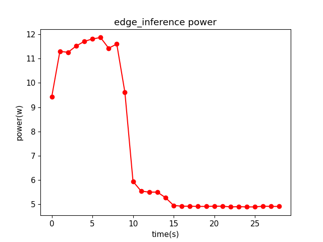

###  **deviceid:02      modelid:03         inference_used_time:37.20983934402466**

10.64 14.97 9.49 13.22 14.23 15.24 14.23 15.25 14.22 14.7 14.89 14.33 15.25 14.36 15.26 14.29 14.72 14.94 14.37 15.27 14.49 15.26 14.5 15.12 14.11 14.49 15.24 14.0 15.26 14.25 15.25 13.95 14.86 14.45 14.44 14.92 12.75 6.55 5.73 5.64 5.64 5.5 5.11 5.03 5.02 5.01 5.0 5.11 5.07 5.01 5.0 5.01 5.0 4.98 4.96 4.96

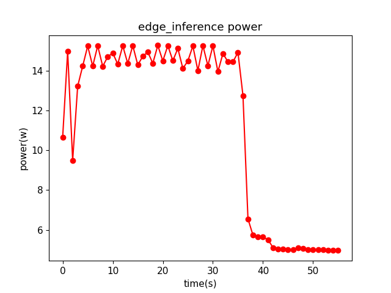

# cloud_benchmark

### 1、cloud  noload  3070  

157.22 117.91 110.95 128.67 132.94 132.48 133.55 133.93 133.52 132.62 135.0 135.18 133.96 133.57 133.42 134.05 133.97 133.99 134.37 97.64 83.82 81.44 80.56 80.33 81.23 80.41 79.89 80.65 81.11 81.11 80.51 79.85 81.31 80.72 80.42 80.15 79.88 80.55 80.7 80.6 80.79 81.11 81.0 79.81 80.81 80.36 81.52 80.94 81.24 81.12 80.99 82.0 81.3 80.96 81.32 80.59 80.53 80.84 81.58 80.54 79.94 80.72

### 2、cloud  decode

 decode_used_time:8.022988557815552    

152.58 144.13 147.06 145.1 145.38 146.16 144.92 146.11 111.58 111.08 110.35 110.63 111.04 110.1 109.91 110.51 67.94 60.18 57.0 58.85 56.72 57.01 57.39 57.62 57.4 56.41 57.83

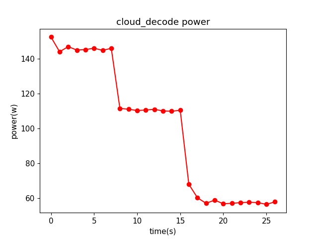

### 3、cloud  inference

modelID:02   inference_used_time:16.49884796142578  
204.12 275.32 242.54 194.9 270.01 259.47 187.05 260.5 271.73 198.0 236.39 275.28 220.35 213.56 276.54 240.82 140.95 123.9 120.17 117.16 117.18 117.7 119.79 118.44 117.25 118.03 117.0 116.07 116.52 117.71 118.44 117.88 117.14 100.6 71.39 65.72 62.43 61.7 62.29 61.22 62.34 62.4 62.76 63.0 63.0 62.75

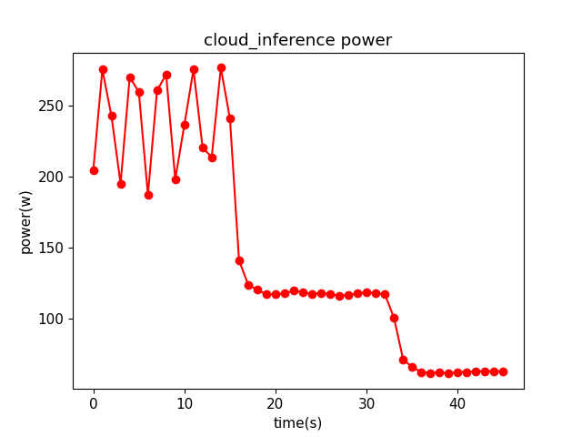

modelID:01   inference_used_time:10.803099155426025  
225.56 220.12 194.12 229.74 183.65 238.34 182.29 239.74 183.82 235.86 176.47 126.29 119.51 118.03 116.01 116.1 117.5 117.92 118.68 115.91 116.32 117.78 119.18 116.66 117.5 118.0 115.28 111.13 71.47 63.82 62.0 60.15 62.37 61.56 62.23 61.44 60.08 61.1 63.06 61.21  

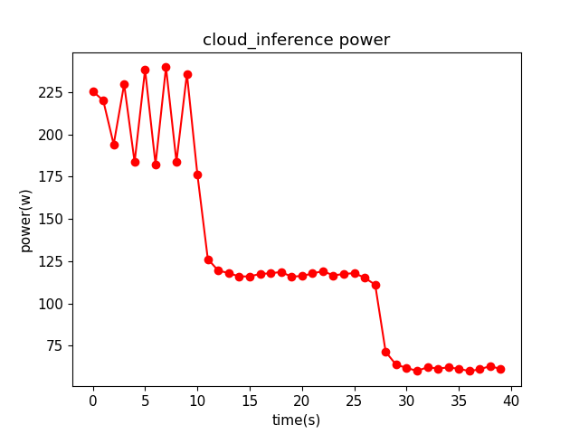

modelID:03   inference_used_time:27.807111740112305  
202.51 290.14 296.34 294.97 279.11 196.39 274.77 295.26 295.7 296.07 222.43 230.4 294.68 295.55 305.61 271.54 193.53 283.52 294.73 295.36 291.41 210.88 245.04 295.22 294.65 294.32 260.33 146.09 123.79 119.27 118.21 116.43 120.15 118.42 117.47 116.86 116.04 116.76 117.07 117.65 116.65 118.11 118.43 118.18 104.21 69.22 64.8 63.94 64.32 63.32 63.29 62.03 62.6 62.73 62.96 62.98

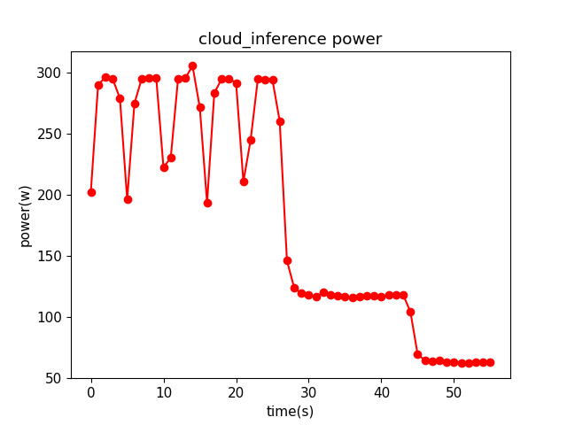
