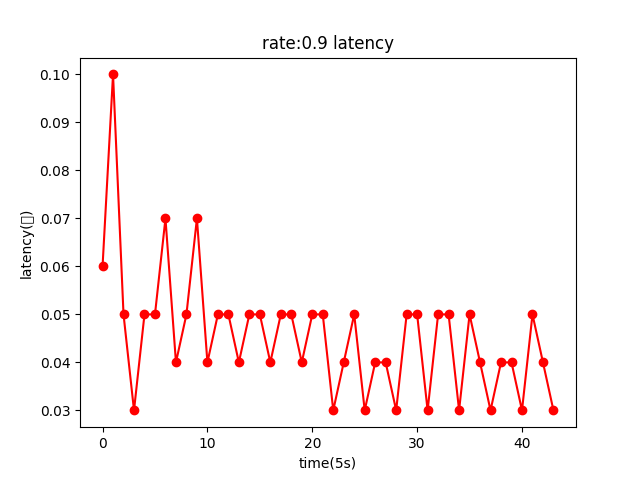
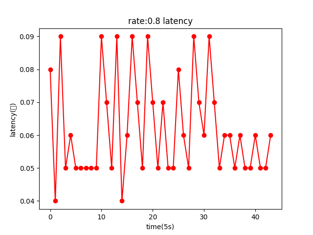

# benchmark

## edge

### 	一、latency

#### 				1、encode: 传入一个视频后，单独encode，获得其1个chunk所需的时间。for循环多次，取其平均。  

##### 			纯encode

| 参数配置 | 单位  (s/chunk) |
| :------: | :-------------: |
| 纯encode |      0.335      |
|          |                 |
|          |                 |

#### 				2、inference:  

##### 	only infernece

从三个不同大小的模型推理数据来看，边端以10帧的大小进行推理，latency较小

|   configuration    | latency  (s/chunk) |
| :----------------: | :----------------: |
| frame:2  model: m  |       2.519        |
| frame:5  model: m  |       2.509        |
| frame:10  model: m |  <u>**2.459**</u>  |
| frame:15  model: m |       2.501        |
| frame:30  model: m |       2.497        |
| frame:2  model: s  |       1.368        |
| frame:5  model: s  |       1.321        |
| frame:10  model: s |  <u>**1.279**</u>  |
| frame:15  model: s |       1.291        |
| frame:30  model: s |       1.689        |
| frame:2  model: n  |       0.964        |
| frame:5  model: n  |       0.891        |
| frame:10  model: n |  <u>**0.833**</u>  |
| frame:15  model: n |       0.847        |
| frame:30  model: n |       0.947        |

##### 	

##### 	encode+inference , single process

当encode和inference同时进行，且使用单进程时，从总体上看，以10帧的大小进行推理，比较合适

|   configuration    | latency (s/chunk) |
| :----------------: | :---------------: |
| frame:5  model: m  |       2.739       |
| frame:10  model: m | <u>**2.687**</u>  |
| frame:15  model: m |       3.102       |
| frame:30  model: m |       3.022       |
| frame:5  model: s  |       1.622       |
| frame:10  model: s |       1.542       |
| frame:15  model: s | <u>**1.407**</u>  |
| frame:30  model: s |       2.158       |
| frame:5  model: n  | **<u>1.256</u>**  |
| frame:10  model: n |       1.321       |
| frame:15  model: n |       1.479       |
| frame:30  model: n |       1.725       |

##### 	encode+inference , multiprocess

多进程情况下，以5帧大小进行推理latency较小

|   configuration    | latency (s/chunk) |
| :----------------: | :---------------: |
| frame:5  model: m  | **<u>2.596</u>**  |
| frame:10  model: m |       2.789       |
| frame:15  model: m |       2.962       |
| frame:30  model: m |       2.989       |
| frame:5  model: s  | <u>**1.377**</u>  |
| frame:10 model: s  |       1.405       |
| frame:15  model: s |       1.587       |
| frame:30  model: s |       1.938       |
| frame:5  model: n  |       0.936       |
| frame:10  model: n |       0.872       |
| frame:15  model: n |                   |
| frame:30  model: n |                   |

##### 不同encode参数 纯推理

|   参数配置    | 单位  (s/chunk) |
| :-----------: | :-------------: |
|  每5帧 模型s  |                 |
| 每10帧 模型s  |                 |
| 每15帧 模型s  |                 |
| 每30帧 模型s  |                 |
|  每5帧 模型m  |                 |
| 每10帧 模型m  |                 |
| 每15帧 模型m  |                 |
| 每30帧 模型m  |                 |
| 每5帧  模型n  |                 |
| 每10帧  模型n |                 |
| 每15帧  模型n |                 |
| 每30帧  模型n |                 |

### 	二、throughput : 统计平均处理完一个chunk的时间，得出一秒钟能够处理的帧数

系统

| 参数配置 | throughput(帧/s) |
| :------: | :--------------: |
|  rate 0  |       6.16       |
| rate 0.3 |       6.30       |
| rate 0.6 |       6.16       |
| rate 0.9 |       5.0        |

### 	三、Acc : encode后，进行推理，循环多次，取其平均精度

此处未改变encode配置

|           参数配置            | acc    |
| :---------------------------: | ------ |
|  纯inference  每10帧  模型m   | 0.844  |
|  纯inference  每15帧  模型m   | 0.844  |
| encode+inference 每10帧 模型m | 0.8436 |
| encode+inference 每15帧 模型m | 0.844  |

#### 720P  1280X720

| model | acc   |
| ----- | ----- |
| s     | 0.750 |
| n     | 0.759 |

#### 480P   854x480

| model | acc   |
| ----- | ----- |
| s     | 0.761 |
| n     | 0.774 |

#### 360P   600x360

| model | acc   |
| ----- | ----- |
| s     | 0.772 |
| n     | 0.779 |

#### 270P  480x270

| model | acc   |
| ----- | ----- |
| s     | 0.748 |
| n     | 0.750 |

revolution为360P的acc最高 其次是480P

在边端n模型acc好于s模型

bitrate变化对传输比特流的影响，比特率越大，字节流越大

3000000时， [512007, 411421, 337584, 566500, 527124, 523586, 540221, 437184, 673037, 634397, 486318, 434194, 397854, 517605, 717756, 636808, 546079, 590578, 543270, 724830, 719096, 710364, 764837, 637882, 504860, 515887, 539933, 530092, 429190, 613917, 564826, 529560, 510173, 470478, 425042, 637576, 565080, 448343, 455812, 336052, 416527, 400819, 323478, 382046, 422616, 400131, 446526, 428686, 366359, 364743, 257143, 438810, 464432, 435641, 529081, 457161, 436467, 591659, 565159, 484621, 494653, 421714, 443952, 477554, 434864, 485696, 375830, 495953, 439664, 415007, 345338, 377445, 245020, 416302, 446120, 483965, 449453, 411434, 443825, 379917, 355985, 363455, 289797, 561291, 683820, 634441, 625767, 725290, 740981, 561421, 574179, 493688, 560862, 440333, 545299, 634437, 557966, 469908, 528534, 412351, 576302]

5000000时，[921750, 769013, 642425, 920614, 869991, 889291, 910916, 723309, 1150276, 1056164, 879817, 806766, 730668, 853701, 1191929, 1059085, 959550, 1057196, 962497, 1239992, 1199189, 1200027, 1249203, 1100774, 1089215, 920767, 938281, 989557, 978643, 794259, 953787, 906271, 891911, 858235, 773858, 1139264, 1065656, 963201, 809801, 804558, 631059, 685533, 587883, 615267, 693614, 660510, 653330, 759242, 735609, 675029, 664041, 519204, 743425, 807386, 741940, 897257, 781952, 751285, 998500, 975416, 835015, 860851, 715210, 745389, 812686, 727360, 822415, 637248, 807531, 734714, 709887, 615920, 645983, 462477, 691357, 756805, 810301, 762041, 696359, 1207547, 749734, 671023, 626454, 636128, 516321]

7000000时，[1305060, 1147699, 965122, 1281526, 1204518, 1250320, 1258983, 1002151, 1598568, 1466819, 1272178, 1199347, 1048942, 1189637, 1659065, 1494308, 1353593, 1517316, 1343524, 1733550, 1639785, 1679891, 1733519, 1531357, 1521688, 1307337, 1337854, 1411695, 1405844, 1137019, 1345066, 1292602, 1296554, 1241966, 1128853, 1613769, 1488859, 1363340, 1169958, 1179075, 968978, 960320, 838912, 888377, 988607, 936183, 928677, 1068945, 1067214, 968873, 980640, 765295, 1072728, 1158650, 1052340, 1271672, 1094719, 1068618, 1406947, 1360363, 1185655, 1203728, 1004441, 1072373, 1149070, 1038423, 1173001, 901556, 1124197, 1043538, 978982, 902098, 953454, 677153, 982013, 1089047, 1142648, 1099874, 989249, 1706283, 1057312, 947624, 915959, 932913, 750644, 1590944, 1575489, 1600303, 1765389, 1699133, 1322483, 1364530, 1392076, 1238600, 1381778, 1106539, 1488609, 1342610, 1166751, 1250446, 990746, 1374324, 1372610]

## cloud

### 一、latency

#### 1、decode 

##### 	纯decode  

| 参数配置 | 单位  (s/chunk) |
| :------: | :-------------: |
|          |                 |
|          |                 |

#### 2、inference

##### only inference

云端只做推理时，以15帧为一个单位进行推理，latency较小

|   configuration    | latency  (s/chunk) |
| :----------------: | :----------------: |
| frame:10  model: s |       0.175        |
| frame:15  model: s |  <u>**0.172**</u>  |
| frame:30  model: s |       0.181        |
| frame:10  model: m |       0.294        |
| frame:15  model: m |  <u>**0.292**</u>  |
| frame:30  model: m |       0.305        |

##### 不同decode参数 纯推理

|   参数配置   | 单位  (s/chunk) |
| :----------: | :-------------: |
| 默认  模型m  |                 |
| bitrate=1000 |                 |
|              |                 |
|              |                 |
|              |                 |
|              |                 |
|              |                 |

##### decode+inference,  single process

云端同时进行decode和inference，且只用一个进程时，以30帧为一个单位进行推理，latency较小

|   configuration    | latency  (s/chunk) |
| :----------------: | :----------------: |
| frame:10  model: s |       0.215        |
| frame:15  model: s |       0.224        |
| frame:30  model: s |  <u>**0.209**</u>  |
| frame:10  model: m |       0.325        |
| frame:15  model: m |       0.319        |
| frame:30  model: m |  <u>**0.318**</u>  |

##### decode+inference,  multiprocess

云端同时进行decode和inference，且用多个进程时，以10帧为一个单位进行推理，latency较小

|   configuration    | latency  (s/chunk) |
| :----------------: | :----------------: |
| frame:10  model: s |  <u>**0.174**</u>  |
| frame:15  model: s |       0.181        |
| frame:30  model: s |       0.181        |
| frame:10  model: m |  <u>**0.292**</u>  |
| frame:15  model: m |       0.297        |
| frame:30  model: m |       0.299        |

### 二、throughput

| 参数配置 | throughput(帧/s) |
| :------: | :--------------: |
| rate0.3  |       8.42       |
| rate 0.6 |       16.5       |
| rate 0.9 |       24.6       |
| rate  1  |      28.08       |

### 三、acc

#### 720P

| model | bitrate(b/s)  默认5000kb/s | acc    |
| ----- | -------------------------- | ------ |
| s     | 500000                     | 0.273  |
| s     | 700000                     | 0.415  |
| s     | 900000                     | 0.505  |
| s     | 1000000                    | 0.528  |
| s     | 1200000                    | 0.581  |
| s     | 1500000                    | 0.617  |
| s     | 1700000                    | 0.652  |
| s     | 2000000                    | 0.681  |
| s     | 2500000                    | 0.702  |
| s     | 3000000                    | 0.714  |
| s     | 5000000                    | 0.739  |
| s     | 7000000                    | 0.747  |
| s     | 9000000                    | 0.748  |
| s     | 10000000                   | 0.748  |
| s     | 15000000                   | 0.752  |
| s     | 16000000                   | 0.749  |
| s     | 17000000                   | 0.750  |
| s     | 20000000                   | 0.749  |
| m     | 30000                      | 0.003  |
| m     | 50000                      | 0.004  |
| m     | 60000                      | 0.005  |
| m     | 80000                      | 0.017  |
| m     | 100000                     | 0.0186 |
| m     | 200000                     | 0.018  |
| m     | 300000                     | 0.064  |
| m     | 400000                     | 0.146  |
| m     | 500000                     | 0.212  |
| m     | 600000                     | 0.285  |
| m     | 700000                     | 0.367  |
| m     | 800000                     | 0.446  |
| m     | 900000                     | 0.494  |
| m     | 1000000                    | 0.529  |
| m     | 1100000                    | 0.581  |
| m     | **1200000**                | 0.614  |
| m     | 1300000                    | 0.641  |
| m     | 1400000                    | 0.661  |
| m     | 1500000                    | 0.664  |
| m     | 1600000                    | 0.689  |
| m     | **1700000**                | 0.700  |
| m     | 1800000                    | 0.707  |
| m     | 1900000                    | 0.710  |
| m     | 2000000                    | 0.725  |
| m     | 2200000                    | 0.731  |
| m     | 2500000                    | 0.746  |
| m     | 2700000                    | 0.749  |
| m     | 3000000                    | 0.753  |
| m     | 3500000                    | 0.765  |
| m     | 4000000                    | 0.770  |
| m     | 4500000                    | 0.772  |
| m     | **5000000**                | 0.773  |
| m     | 6000000                    | 0.778  |
| m     | 7000000                    | 0.780  |
| m     | 9000000                    | 0.782  |
| m     | 10000000                   | 0.782  |
| m     | 15000000                   | 0.784  |
| m     | 16000000                   | 0.783  |
| m     | 17000000                   | 0.786  |
| m     | 20000000                   | 0.782  |

#### 480P

| model | bitrate(b/s)  默认5000kb/s | acc   |
| ----- | -------------------------- | ----- |
| s     | 500000                     | 0.499 |
| s     | 700000                     | 0.575 |
| s     | 900000                     | 0.617 |
| s     | 1000000                    | 0.638 |
| s     | 1200000                    | 0.661 |
| s     | 1500000                    | 0.688 |
| s     | 1700000                    | 0.704 |
| s     | 2000000                    | 0.727 |
| s     | 2500000                    | 0.740 |
| s     | 3000000                    | 0.751 |
| s     | ****5000000****            | 0.766 |
| s     | 7000000                    | 0.767 |
| s     | 9000000                    | 0.765 |
| s     | 10000000                   | 0.764 |
| s     | 15000000                   | 0.763 |
| s     | 16000000                   | 0.764 |
| s     | 17000000                   | 0.763 |
| s     | 20000000                   | 0.762 |
| m     | 30000                      | 0.006 |
| m     | 50000                      | 0.007 |
| m     | 60000                      | 0.010 |
| m     | 80000                      | 0.017 |
| m     | 100000                     | 0.018 |
| m     | 200000                     | 0.142 |
| m     | 300000                     | 0.299 |
| m     | 400000                     | 0.435 |
| m     | 500000                     | 0.493 |
| m     | 600000                     | 0.571 |
| m     | 700000                     | 0.593 |
| m     | 800000                     | 0.625 |
| m     | 900000                     | 0.645 |
| m     | 1000000                    | 0.678 |
| m     | 1100000                    | 0.689 |
| m     | 1200000                    | 0.703 |
| m     | 1300000                    | 0.713 |
| m     | 1400000                    | 0.721 |
| m     | 1500000                    | 0.735 |
| m     | 1600000                    | 0.738 |
| m     | 1700000                    | 0.744 |
| m     | 1800000                    | 0.752 |
| m     | 1900000                    | 0.764 |
| m     | 2000000                    | 0.773 |
| m     | 2200000                    | 0.778 |
| m     | 2500000                    | 0.784 |
| m     | 2700000                    | 0.788 |
| m     | 3000000                    | 0.793 |
| m     | 3500000                    | 0.804 |
| m     | 4000000                    | 0.806 |
| m     | 4500000                    | 0.810 |
| m     | **5000000**                | 0.807 |
| m     | 6000000                    | 0.809 |
| m     | 7000000                    | 0.808 |
| m     | 9000000                    | 0.808 |
| m     | 10000000                   | 0.809 |
| m     | 15000000                   | 0.806 |
| m     | 16000000                   | 0.809 |
| m     | 17000000                   | 0.806 |
| m     | 20000000                   | 0.806 |

#### 360P

| model | bitrate(b/s)  默认5000kb/s | acc    |
| ----- | -------------------------- | ------ |
| s     | 500000                     | 0.587  |
| s     | 700000                     | 0.645  |
| s     | 900000                     | 0.681  |
| s     | 1000000                    | 0.699  |
| s     | 1200000                    | 0.729  |
| s     | 1500000                    | 0.741  |
| s     | 1700000                    | 0.758  |
| s     | 2000000                    | 0.763  |
| s     | 2500000                    | 0.767  |
| s     | ****3000000****            | 0.774  |
| s     | 5000000                    | 0.775  |
| s     | 7000000                    | 0.772  |
| s     | 9000000                    | 0.773  |
| s     | 10000000                   | 0.774  |
| s     | 15000000                   | 0.772  |
| s     | 16000000                   | 0.773  |
| s     | 17000000                   | 0.772  |
| s     | 20000000                   | 0.773  |
| m     | 30000                      | 0.025  |
| m     | 50000                      | 0.032  |
| m     | 60000                      | 0.045  |
| m     | 80000                      | 0.086  |
| m     | 100000                     | 0.159  |
| m     | 200000                     | 0.401  |
| m     | 300000                     | 0.518  |
| m     | 400000                     | 0.592  |
| m     | 500000                     | 0.647  |
| m     | 600000                     | 0.670  |
| m     | 700000                     | 0.699  |
| m     | 800000                     | 0.726  |
| m     | 900000                     | 0.746  |
| m     | 1000000                    | 0.759  |
| m     | 1100000                    | 0.769  |
| m     | 1200000                    | 0.783  |
| m     | 1300000                    | 0.790  |
| m     | 1400000                    | 0.801  |
| m     | 1500000                    | 0.803  |
| m     | 1600000                    | 0.817  |
| m     | 1700000                    | 0.818  |
| m     | 1800000                    | 0.813  |
| m     | 1900000                    | 0.814  |
| m     | 2000000                    | 0.815  |
| m     | 2200000                    | 0.814  |
| m     | 2500000                    | 0.819  |
| m     | 2700000                    | 0.820  |
| m     | ****3000000****            | 0.820  |
| m     | 3500000                    | 0.8208 |
| m     | 4000000                    | 0.8213 |
| m     | 4500000                    | 0.820  |
| m     | **5000000**                | 0.820  |
| m     | 6000000                    | 0.819  |
| m     | 7000000                    | 0.817  |
| m     | 9000000                    | 0.818  |
| m     | 10000000                   | 0.817  |
| m     | 15000000                   | 0.817  |
| m     | 16000000                   | 0.817  |
| m     | 17000000                   | 0.816  |
| m     | 20000000                   | 0.816  |

#### 270P

| model | bitrate(b/s)  默认5000kb/s | acc   |
| ----- | -------------------------- | ----- |
| s     | 500000                     | 0.585 |
| s     | 700000                     | 0.650 |
| s     | 900000                     | 0.685 |
| s     | 1000000                    | 0.698 |
| s     | 1200000                    | 0.719 |
| s     | 1500000                    | 0.734 |
| s     | 1700000                    | 0.739 |
| s     | 2000000                    | 0.741 |
| s     | 2500000                    | 0.749 |
| s     | ****3000000****            | 0.748 |
| s     | **5000000**                | 0.751 |
| s     | 7000000                    | 0.749 |
| s     | 9000000                    | 0.749 |
| s     | 10000000                   | 0.748 |
| s     | 15000000                   | 0.747 |
| s     | 16000000                   | 0.748 |
| s     | 17000000                   | 0.748 |
| s     | 20000000                   | 0.748 |
| m     | 30000                      | 0.007 |
| m     | 50000                      | 0.060 |
| m     | 60000                      | 0.090 |
| m     | 80000                      | 0.153 |
| m     | 100000                     | 0.206 |
| m     | 200000                     | 0.420 |
| m     | 300000                     | 0.509 |
| m     | 400000                     | 0.576 |
| m     | 500000                     | 0.635 |
| m     | 600000                     | 0.676 |
| m     | 700000                     | 0.705 |
| m     | 800000                     | 0.725 |
| m     | 900000                     | 0.751 |
| m     | 1000000                    | 0.754 |
| m     | 1100000                    | 0.769 |
| m     | 1200000                    | 0.780 |
| m     | 1300000                    | 0.781 |
| m     | 1400000                    | 0.787 |
| m     | 1500000                    | 0.788 |
| m     | 1600000                    | 0.795 |
| m     | 1700000                    | 0.792 |
| m     | 1800000                    | 0.797 |
| m     | 1900000                    | 0.794 |
| m     | 2000000                    | 0.797 |
| m     | 2200000                    | 0.801 |
| m     | 2500000                    | 0.802 |
| m     | 2700000                    | 0.803 |
| m     | **3000000**                | 0.804 |
| m     | 3500000                    | 0.802 |
| m     | 4000000                    | 0.802 |
| m     | 4500000                    | 0.802 |
| m     | 5000000                    | 0.802 |
| m     | 6000000                    | 0.801 |
| m     | 7000000                    | 0.798 |
| m     | 9000000                    | 0.799 |
| m     | 10000000                   | 0.799 |
| m     | 15000000                   | 0.800 |
| m     | 16000000                   | 0.799 |
| m     | 17000000                   | 0.799 |
| m     | 20000000                   | 0.798 |

#### 240P  240x320

| model | bitrate(b/s)  默认5000kb/s | acc   |
| ----- | -------------------------- | ----- |
| m     | 30000                      | 0.038 |
| m     | 50000                      | 0.104 |
| m     | 60000                      | 0.155 |
| m     | 80000                      | 0.249 |
| m     | 100000                     | 0.290 |
| m     | 200000                     | 0.487 |
| m     | 300000                     | 0.585 |
| m     | 400000                     | 0.657 |
| m     | 500000                     | 0.703 |
| m     | 600000                     | 0.723 |
| m     | 700000                     | 0.751 |
| m     | 800000                     | 0.763 |
| m     | 900000                     | 0.768 |
| m     | 1000000                    | 0.772 |
| m     | 1100000                    | 0.777 |
| m     | 1200000                    | 0.778 |
| m     | 1300000                    | 0.780 |
| m     | 1400000                    | 0.783 |
| m     | 1500000                    | 0.785 |
| m     | 1600000                    | 0.783 |
| m     | 1700000                    | 0.785 |
| m     | 1800000                    | 0.784 |
| m     | 1900000                    | 0.786 |
| m     | 2000000                    | 0.788 |
| m     | 2200000                    | 0.790 |
| m     | 2500000                    | 0.790 |
| m     | 2700000                    | 0.791 |
| m     | **3000000**                | 0.791 |
| m     | 3500000                    | 0.789 |
| m     | 4000000                    | 0.788 |
| m     | 4500000                    | 0.787 |
| m     | 5000000                    | 0.790 |
| m     | 6000000                    | 0.789 |
| m     | 7000000                    | 0.788 |
| m     | 9000000                    | 0.786 |
| m     | 10000000                   | 0.785 |
| m     | 15000000                   | 0.785 |

#### 144P

| model | bitrate(b/s)  默认5000kb/s | acc   |
| ----- | -------------------------- | ----- |
| m     | 10000                      | 0.012 |
| m     | 20000                      | 0.074 |
| m     | 30000                      | 0.160 |
| m     | 50000                      | 0.254 |
| m     | 60000                      | 0.294 |
| m     | 80000                      | 0.340 |
| m     | 100000                     | 0.397 |
| m     | 200000                     | 0.597 |
| m     | 300000                     | 0.672 |
| m     | 400000                     | 0.704 |
| m     | 500000                     | 0.717 |
| m     | 600000                     | 0.728 |
| m     | 700000                     | 0.735 |
| m     | 800000                     | 0.734 |
| m     | 900000                     | 0.738 |
| m     | 1000000                    | 0.739 |
| m     | 1100000                    | 0.739 |
| m     | 1200000                    | 0.739 |
| m     | 1300000                    | 0.736 |
| m     | 1400000                    | 0.740 |
| m     | 1500000                    | 0.737 |
| m     | 1600000                    | 0.735 |
| m     | 1700000                    | 0.736 |
| m     | 1800000                    | 0.739 |
| m     | 1900000                    | 0.739 |
| m     | 2000000                    | 0.737 |
| m     | 2200000                    | 0.738 |
| m     | 2500000                    | 0.739 |
| m     | 2700000                    | 0.738 |
| m     | **3000000**                | 0.739 |
| m     | 3500000                    | 0.739 |
| m     | 4000000                    | 0.737 |
| m     | 4500000                    | 0.739 |
| m     | 5000000                    | 0.738 |
| m     | 6000000                    | 0.738 |
| m     | 7000000                    | 0.738 |
| m     | 9000000                    | 0.738 |
| m     | 10000000                   | 0.738 |
| m     | 15000000                   | 0.738 |

#### 96P

| model | bitrate(b/s)  默认5000kb/s | acc   |
| ----- | -------------------------- | ----- |
| m     | 10000                      | 0.054 |
| m     | 20000                      | 0.185 |
| m     | 30000                      | 0.253 |
| m     | 50000                      | 0.328 |
| m     | 60000                      | 0.356 |
| m     | 80000                      | 0.430 |
| m     | 100000                     | 0.493 |
| m     | 200000                     | 0.648 |
| m     | 300000                     | 0.673 |
| m     | 400000                     | 0.683 |
| m     | 500000                     | 0.694 |
| m     | 600000                     | 0.700 |
| m     | 700000                     | 0.698 |
| m     | 800000                     | 0.700 |
| m     | 900000                     | 0.696 |
| m     | 1000000                    | 0.698 |
| m     | 1100000                    | 0.698 |
| m     | 1200000                    | 0.698 |
| m     | 1300000                    | 0.697 |
| m     | 1400000                    | 0.698 |
| m     | 1500000                    | 0.697 |
| m     | 1600000                    | 0.698 |
| m     | 1700000                    | 0.697 |
| m     | 1800000                    | 0.697 |
| m     | 1900000                    | 0.699 |
| m     | 2000000                    | 0.699 |
| m     | 2200000                    | 0.699 |
| m     | 2500000                    | 0.698 |
| m     | 2700000                    | 0.699 |
| m     | 3000000                    | 0.699 |
| m     | 3500000                    | 0.699 |
| m     | 4000000                    | 0.699 |
| m     | 4500000                    | 0.699 |
| m     | 5000000                    | 0.699 |
| m     | 6000000                    | 0.699 |
| m     | 7000000                    | 0.699 |
| m     | 9000000                    | 0.699 |
| m     | 10000000                   | 0.699 |
| m     | 15000000                   | 0.699 |

#### 72P

| model | bitrate(b/s)  默认5000kb/s | acc   |
| ----- | -------------------------- | ----- |
| m     | 10000                      | 0.053 |
| m     | 20000                      | 0.155 |
| m     | 30000                      | 0.221 |
| m     | 50000                      | 0.295 |
| m     | 60000                      | 0.342 |
| m     | 80000                      | 0.395 |
| m     | 100000                     | 0.461 |
| m     | 200000                     | 0.573 |
| m     | 300000                     | 0.602 |
| m     | 400000                     | 0.614 |
| m     | 500000                     | 0.619 |
| m     | 600000                     | 0.627 |
| m     | 700000                     | 0.626 |
| m     | 800000                     | 0.624 |
| m     | 900000                     | 0.626 |
| m     | 1000000                    | 0.627 |
| m     | 1100000                    | 0.627 |
| m     | 1200000                    | 0.627 |
| m     | 1300000                    | 0.627 |
| m     | 1400000                    | 0.628 |
| m     | 1500000                    | 0.628 |
| m     | 1600000                    | 0.627 |
| m     | 1700000                    | 0.627 |
| m     | 1800000                    | 0.627 |
| m     | 1900000                    | 0.628 |
| m     | 2000000                    | 0.627 |
| m     | 2200000                    | 0.627 |
| m     | 2500000                    | 0.627 |
| m     | 2700000                    | 0.627 |
| m     | 3000000                    | 0.627 |
| m     | 3500000                    | 0.627 |
| m     | 4000000                    | 0.627 |
| m     | 4500000                    | 0.627 |
| m     | 5000000                    | 0.627 |
| m     | 6000000                    | 0.627 |
| m     | 7000000                    | 0.627 |
| m     | 9000000                    | 0.627 |
| m     | 10000000                   | 0.627 |
| m     | 15000000                   | 0.627 |

1、bitrate对acc有影响,对于分辨率高的，bitrate较高acc才会较高，分辨率低的，bitrate较低，acc较高

2、resolution为360P的acc最高 其次是480P，bitrate选择3000k-7000k，acc较高

模型固定的前提下，acc随resolution和bitrate变化，在bitrate较低时，resolution对acc影响较大，bitrate达到5000k时，影响较小

# system

### 

| rate | latency(一帧) |
| ---- | ------------- |
| 1    | 0.03          |
| 0.9  | 0.045         |
| 0.8  | 0.062         |
|      |               |

